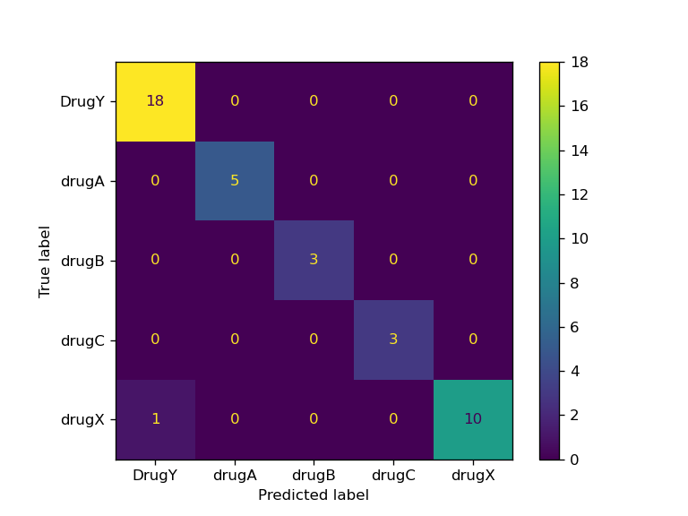

# 💊 Drug Classification - CI/CD notions
This repository is meant to delve the notion of MLOps throughout the CI/CD pipelines using GitHub Actions and HuggingFace Sapce for deployment. In a nutshell, here are the steps after pushing the code:

1. Loading dataset
2. Training an ML model (Classification)
3. Log the model in a [DagsHub repository](https://dagshub.com/motta607/drug_classification) using `mlflow` framework
4. Automatically promote the model for production if it beats the latter model based on pre-defined metrics (f1-score)
5. Create some artifacts (a heatmap of the confusion matrix and store some metrics like accuracy and f1)
6. Login and push the `streamlit` app on [Hugging Face Space](https://huggingface.co/spaces/davidemotta/CI-CD-ML). The app uses the model ready for production stored in DagsHub.
 - - - 
# 🤖 MLOps
In recent years, Machine Learning Operations (MLOps) has emerged as one of the most sought-after fields in the tech industry. With businesses increasingly relying on data-driven solutions, MLOps professionals are in high demand to deploy and manage machine learning models effectively.

But what exactly is MLOps, and what does it take to become an MLOps engineer?


## What is MLOps?
MLOps, also known as machine learning operations, refers to the practices and processes used for deploying, managing, and monitoring machine learning models in production. It combines elements from machine learning, software engineering, and operations to create a streamlined workflow for ML projects.


## `Makefiles` in CI/CD Pipelines

### Benefits of Makefiles in CI/CD

#### 1. **Consistency Across Environments**
Makefiles ensure that the same commands run identically in local development, CI/CD pipelines, and production environments. This eliminates the "it works on my machine" problem.

#### 2. **Simplified Command Interface**
Instead of remembering complex command sequences with multiple flags and parameters, developers can execute simple commands like `make train` or `make deploy`.

#### 3. **Documentation as Code**
The Makefile serves as executable documentation, clearly showing all available operations and their dependencies. New team members can quickly understand the project workflow.

#### 4. **Platform Independence**
While developed on Unix systems, Makefiles work across different CI/CD platforms (GitHub Actions, GitLab CI, Jenkins, etc.) with minimal modifications.

#### 5. **Dependency Management**
Make automatically handles target dependencies, ensuring tasks execute in the correct order and only when necessary.

#### 6. **Reduced CI/CD Configuration Complexity**
CI/CD configuration files remain clean and simple, delegating complex logic to the Makefile rather than embedding bash scripts in YAML files.

---

## Makefile Breakdown: Step-by-Step Explanation

### Configuration Variable

```makefile
CONDA_ENV = drug_cicd
```

**Purpose**: Defines the Conda environment name used throughout the pipeline. This ensures consistency across all targets that need to activate the environment.

---

### Target: `install`

```makefile
install:
    conda env update --file env.yaml --prune || conda env create --file env.yaml
```

**What it does**:
1. Attempts to update an existing Conda environment from `env.yaml`
2. The `--prune` flag removes dependencies no longer in the specification
3. If the environment doesn't exist (update fails), creates it from scratch using `||` (logical OR)

**When to use**: First step in CI/CD pipeline or when setting up local environment.

---

### Target: `format`

```makefile
format:
    black *.py
```

**What it does**:
Automatically formats all Python files in the current directory using Black code formatter.

**When to use**: 
- As a pre-commit hook
- In CI/CD to verify code formatting standards
- Before pushing code to ensure consistent style

---

### Target: `test`

```makefile
test:
    conda run -n $(CONDA_ENV) pytest -q
```

**What it does**:
1. Activates the specified Conda environment
2. Runs tests using `pytest` in quiet mode (`-q`)


**When to use**: Every time code changes are made to ensure no regressions.

---

### Target: `train`

```makefile
train:
    conda run -n $(CONDA_ENV) python train.py
```

**What it does**:
1. Activates the specified Conda environment
2. Executes the `train.py` script to train the machine learning model
3. Uses `conda run` to ensure proper environment activation in non-interactive shells

**When to use**: Main training step in the CI/CD pipeline when new data or code changes trigger retraining.

---

### Target: `eval`

```makefile
eval:
    echo "### Model Metrics" > report.md
    cat ./results/metrics.txt >> report.md
    echo '\n### Confusion Matrix Plot' >> report.md
    echo '' >> report.md
    conda run -n $(CONDA_ENV) cml comment create report.md
```

**What it does**:
1. Creates a Markdown report file starting with a "Model Metrics" header
2. Appends the metrics from `./results/metrics.txt`
3. Adds a "Confusion Matrix Plot" section
4. Embeds the confusion matrix image using Markdown syntax
5. Uses CML (Continuous Machine Learning) to post the report as a comment on the pull request

**When to use**: After model training to automatically generate and share evaluation results with the team.

**Dependencies**: Requires CML to be installed and configured with repository access.

---

### Target: `clean`

```makefile
clean:
    conda env remove -n $(CONDA_ENV) -y
```

**What it does**:
Removes the Conda environment completely, with automatic yes confirmation (`-y` flag).

**When to use**:
- Cleanup step at the end of CI/CD pipeline
- When you need to rebuild the environment from scratch
- To free up space in CI/CD runners

---

### Target: `update-branch`

```makefile
update-branch:
    git config --global user.name $(USER_NAME)
    git config --global user.email $(USER_EMAIL)
    git commit -am "Update with new results"
    git push --force origin HEAD:update
```

**What it does**:
1. Configures Git with the user name and email (from environment variables)
2. Commits all modified files with a standardized message
3. Force pushes to the `update` branch

**When to use**: After training and evaluation to commit new model artifacts and results.

**Required Environment Variables**:
- `USER_NAME`: Git commit author name
- `USER_EMAIL`: Git commit author email

---

### Target: `hf-login`

```makefile
hf-login:
    git pull origin update
    git switch update
    pip install -U "huggingface_hub[cli]"
    hf auth login --token $(HF) --add-to-git-credential
```

**What it does**:
1. Pulls latest changes from the `update` branch
2. Switches to the `update` branch
3. Installs/updates the Hugging Face Hub CLI tools
4. Authenticates with Hugging Face using a token and stores credentials

**When to use**: Preparation step before deploying to Hugging Face Spaces.

**Required Environment Variables**:
- `HF`: Hugging Face authentication token

---

### Target: `push-hub`

```makefile
push-hub:
    hf upload davidemotta/CI-CD-ML ./app  /src --repo-type=space --commit-message="Sync App files"
    hf upload davidemotta/CI-CD-ML ./model /model --repo-type=space --commit-message="Sync Model"
    hf upload davidemotta/CI-CD-ML ./results /metrics --repo-type=space --commit-message="Sync Model"
```

**What it does**:
Uploads three components to the Hugging Face Space `davidemotta/CI-CD-ML`:
1. Application files from `./app` to `/src` directory
2. Model files from `./model` to `/model` directory
3. Results/metrics from `./results` to `/metrics` directory

Each upload creates a separate commit with a descriptive message.

**When to use**: Deployment step to sync all artifacts to the Hugging Face Space.

---

### Target: `deploy`

```makefile
deploy: hf-login push-hub
```

**What it does**:
Defines a deployment pipeline that executes in order:
1. First: `hf-login` (authentication)
2. Then: `push-hub` (upload artifacts)

**When to use**: Single command to deploy everything to Hugging Face after successful training and evaluation.

---

### Complete CI/CD Pipeline Flow

A typical CI/CD pipeline using this Makefile would execute:

```bash
make install    ## Setup environment
make format     ## Verify code formatting
make train      ## Train the model
make eval       ## Evaluate and report results
make update-branch  ## Commit results
make deploy     ## Deploy to Hugging Face
make clean      ## Cleanup
```

This ensures a reproducible, documented, and maintainable ML pipeline that can run anywhere with minimal configuration.

- - -

## Continuous Integration - CI
Continuous Integration (CI) is a modern software development practice that emphasizes the frequent integration of code changes into a shared repository.  
The idea is simple: every time a developer pushes code, the system automatically builds, tests, and validates the new changes.  
This approach reduces the risk of "integration hell," where merging large, untested branches late in the process can lead to bugs, conflicts, and broken software.

Key benefits of CI:
- **Early detection of bugs**: problems are caught as soon as they are introduced.
- **Faster development cycles**: automated checks reduce manual testing effort.
- **Improved collaboration**: teams integrate often, ensuring everyone works on a consistent codebase.
- **Reliable deployments**: code that passes the CI pipeline is usually stable and production-ready.

---

### Workflow in the Diagram

The diagram illustrates a typical **CI workflow** integrated with **GitHub Actions**:

1. **Trigger**:  
   The workflow starts when a developer **pushes code to the `main` branch** of the GitHub repository.  
   GitHub Actions detects this event and automatically initiates the pipeline.

2. **Training Stage (Train)**:  
   - The pipeline begins by running the training code.  
   - This could involve preprocessing data, training a machine learning model, and saving the trained artifact.

3. **Model Artifact (Model)**:  
   - Once the training step finishes, the trained model is stored (as a file or artifact).  
   - This artifact is used in the following stages.

4. **Evaluation Stage (Evaluate)**:  
   - The trained model is evaluated to check its performance (e.g., accuracy, precision, recall, F1-score).  
   - If the model does not meet the expected quality metrics, the CI process can fail and notify developers.

5. **Feedback Loop**:  
   - Developers receive immediate feedback from the CI system.  
   - If something breaks (code errors, failing tests, or underperforming models), they are alerted quickly and can fix issues before merging further changes.


### Continuous Integration (CI) Workflow Documentation

#### Overview

This GitHub Actions workflow automates testing, training, and evaluation of your ML model whenever code is pushed or pull requests are created.

---

#### Workflow Configuration

```yaml
name: Continuous Integration
```

Displays as "Continuous Integration" in the GitHub Actions UI.

---

#### Trigger Events

```yaml
on:
  push:
    branches: ["main"]
  pull_request:
    branches: ["main"]
  workflow_dispatch:
```

##### Automatic Triggers

**`push` to main branch**:
- Runs when code is pushed directly to main
- Ensures main branch always has trained models and metrics

**`pull_request` to main branch**:
- Runs when PR is opened or updated targeting main
- Validates changes before merging
- Posts evaluation metrics as PR comments

##### Manual Trigger: `workflow_dispatch`
- Allows manual execution via GitHub Actions UI
- Useful for retraining models or testing the pipeline

---

#### Permissions

```yaml
permissions: write-all
```

Grants the workflow full read/write access to:
- Repository code (for committing results)
- Pull requests (for posting CML comments)
- Actions (for workflow management)

**Note**: In production, consider limiting to specific permissions: `contents: write`, `pull-requests: write`

---

#### Job: `build`

```yaml
jobs:
  build:
    runs-on: ubuntu-latest
```

Runs on a GitHub-hosted Ubuntu VM with pre-installed Python, Conda, and development tools.

---

#### Workflow Steps

##### Step 1: Checkout Code

```yaml
- uses: actions/checkout@v3
```

Clones the repository including training data, scripts, and configuration files.

---

##### Step 2: Setup CML

```yaml
- uses: iterative/setup-cml@v2
```

Installs Continuous Machine Learning (CML) tools for:
- Posting model metrics as PR comments
- Creating visual reports with plots
- Comparing model performance across runs

---

##### Step 3: Install Packages

```yaml
- name: Install Packages
  run: make install
```

**Executes**: `conda env update --file env.yaml --prune || conda env create --file env.yaml`

Creates or updates the Conda environment with all required dependencies (scikit-learn, pandas, etc.).

---

##### Step 4: Tests
  
  ```yaml

      - name: Run unit tests
        run: make test 

      - name: All tests passed 🎉
        if: ${{ success() }}
        run: echo "✅ Tutti i test sono passati con successo!"
  ```

**Executes**: `conda run -n drug_cicd pytest -q`

Runs unit tests using `pytest` to ensure code correctness before training.

  ---

##### Step 5: Train Model

```yaml
- name: Train
  run: make train
```

**Executes**: `conda run -n drug_cicd python train.py`

Trains the machine learning model:
- Loads training data
- Trains the model
- Saves model artifacts to `./model/`
- Saves metrics to `./results/`

---

##### Step 6: Evaluation

```yaml
- name: Evaluation
  env:
    REPO_TOKEN: ${{ secrets.TOKEN_GIT }}
  run: make eval
```

**Environment variable**:
- `REPO_TOKEN`: GitHub token for posting PR comments
- Retrieved from `secrets.TOKEN_GIT`

**Executes**: Creates a markdown report with:
- Model metrics (accuracy, precision, recall, F1-score)
- Confusion matrix visualization
- Posts report as a comment on the PR using CML

**Output**: `report.md` containing formatted evaluation results

---

##### Step 7: Clean

```yaml
- name: Clean
  run: make clean
```

**Executes**: `conda env remove -n drug_cicd -y`

Removes the Conda environment to:
- Free up disk space on the runner
- Ensure clean state for next run
- Prevent environment conflicts

---

##### Step 7: Update Branch

```yaml
- name: Update Branch
  env:
    NAME: ${{ secrets.USER_NAME }}
    EMAIL: ${{ secrets.USER_EMAIL }}
  run: make update-branch USER_NAME=$NAME USER_EMAIL=$EMAIL
```

**Environment variables**:
- `NAME`: Git commit author name from `secrets.USER_NAME`
- `EMAIL`: Git commit author email from `secrets.USER_EMAIL`

**Executes**:
1. Configures Git with provided credentials
2. Commits all changes (trained model, results, metrics)
3. Force pushes to `update` branch

**Purpose**: Maintains a separate branch with latest model artifacts, ready for deployment.

---

#### Pipeline Flow

1. **Trigger**: Code push or PR creation
2. **Setup**: Checkout code → Install CML → Create environment
3. **Testing**: Run unit tests
4. **Training**: Train model with new code/data
5. **Evaluation**: Generate metrics → Post to PR
6. **Cleanup**: Remove environment
7. **Commit**: Push results to `update` branch
8. **Deploy**: Triggers CD workflow (automatic deployment)

---

#### Required Setup

##### GitHub Secrets

| Secret Name | Purpose | How to Get |
|-------------|---------|------------|
| `TOKEN_GIT` | Post CML comments to PRs | GitHub Settings → Developer settings → Personal access tokens → Generate (with `repo` scope) |
| `USER_NAME` | Git commit author name | Your GitHub username or display name |
| `USER_EMAIL` | Git commit author email | Your GitHub email address |

**Setup location**: Repository → Settings → Secrets and variables → Actions

##### Required Files

- `env.yaml` - Conda environment specification
- `train.py` - Model training script
- `Makefile` - Build automation commands
- Training data in the repository or accessible location

---

#### Expected Outputs

##### During Workflow Run
- Conda environment installation logs
- Model training progress
- Evaluation metrics in workflow logs

##### After Workflow Completion
- `./model/` - Trained model files
- `./results/metrics.txt` - Performance metrics
- `./results/model_results.png` - Confusion matrix plot
- `report.md` - Formatted evaluation report
- PR comment with metrics (if triggered by PR)
- Committed artifacts in `update` branch

---

#### Troubleshooting

| Issue | Solution |
|-------|----------|
| CML comment fails | Verify `TOKEN_GIT` has `repo` scope and is valid |
| Environment creation fails | Check `env.yaml` syntax and package availability |
| Training fails | Review `train.py` logs and data availability |
| Commit fails | Verify `USER_NAME` and `USER_EMAIL` secrets exist |
| Update branch doesn't exist | Manually create `update` branch or modify Makefile |

---

#### Key Benefits

- **Automated Testing**: Every code change triggers model retraining
- **Transparency**: Metrics posted directly in PRs for easy review
- **Reproducibility**: Consistent environment via Conda
- **Version Control**: Model artifacts tracked in separate branch
- **Fast Feedback**: Developers see model performance immediately
- **CI/CD Integration**: Automatically triggers deployment on completion

This workflow ensures your ML model is continuously validated and ready for deployment with every code change.
 - - -
## Continuous Deployment - CD

**Continuous Deployment (CD)** is the stage that follows Continuous Integration (CI).  
While CI focuses on automatically testing and validating changes, CD takes it a step further by **automatically releasing those validated changes into production**.

The main goal of CD is to ensure that every new version of the model or application is made available to users **without manual intervention**, reducing the time between development and release.


### Workflow in the Diagram

In the diagram, the **CD pipeline** starts **at the end of CI**, once the model has already been trained and validated:

1. **GitHub Actions as the Orchestrator**  
   - When CI finishes successfully, GitHub Actions triggers the CD workflow.  
   - This happens automatically, without requiring manual steps.

2. **Pull Files**  
   - The pipeline fetches the latest files from the repository.  
   - This ensures it has the most up-to-date version of the code and the trained model.

3. **Upload Model**  
   - The validated model is uploaded to a production-ready destination.  
   - Examples include: Hugging Face Hub, a cloud storage bucket (S3, GCS), or a model registry.

4. **Deploy App**  
   - The application that uses the model is deployed (or redeployed).  
   - This could mean:
     - Updating a Docker container with the new model.  
     - Restarting a Streamlit app on Hugging Face Spaces.  
     - Updating an API endpoint that serves predictions.  


### Continuous Deployment (CD) Workflow Documentation

#### Overview

This GitHub Actions workflow automates deployment of your ML model to Hugging Face Spaces after the CI workflow completes or when manually triggered.

---

#### Workflow Configuration

```yaml
name: Continuous Deployment
```

Displays as "Continuous Deployment" in the GitHub Actions UI.

---

#### Trigger Events

```yaml
on:
  workflow_run:
    workflows: ["Continuous Integration"]
    types:
      - completed

  workflow_dispatch:
```

##### Automatic Trigger: `workflow_run`
- Runs automatically when the "Continuous Integration" workflow completes
- Triggers regardless of CI success or failure
- **Note**: To deploy only on success, add `if: ${{ github.event.workflow_run.conclusion == 'success' }}`

##### Manual Trigger: `workflow_dispatch`
- Allows manual execution via GitHub Actions UI
- Useful for emergency deployments, rollbacks, or testing

---

#### Job: `build`

```yaml
jobs:
  build:
    runs-on: ubuntu-latest
```

Runs on a GitHub-hosted Ubuntu virtual machine with 2-core CPU, 7GB RAM, and pre-installed tools (Git, Python, Make, etc.).

---

#### Workflow Steps

##### Step 1: Checkout Code

```yaml
- uses: actions/checkout@v3
```

Clones your repository to make all files available (code, models, results, Makefile).

##### Step 2: Deploy to Hugging Face

```yaml
- name: Deployment To Hugging Face
  env:
    HF: ${{ secrets.TOKEN_HF }}
  run: make deploy HF=$HF
```

**Environment variable**:
- `HF`: Hugging Face authentication token from GitHub Secrets
- Retrieved from `secrets.TOKEN_HF` (configured in repository settings)

**Deployment command**: Executes `make deploy` which:
1. Authenticates with Hugging Face
2. Uploads `./app` → `/src` in HF Space
3. Uploads `./model` → `/model` in HF Space  
4. Uploads `./results` → `/metrics` in HF Space
5. Deploys to `davidemotta/CI-CD-ML` Space

---

#### Deployment Flow

**Automatic deployment**:
1. Code push triggers CI workflow
2. CI completes (tests, training, evaluation)
3. CD workflow automatically starts
4. Code checkout → HF authentication → Upload → Live deployment

**Manual deployment**:
1. Navigate to Actions tab → "Continuous Deployment"
2. Click "Run workflow" → Select branch → Deploy

---

#### Required Setup

##### GitHub Secret
**Name**: `TOKEN_HF`  
**Value**: Your Hugging Face token with write permissions

**Setup steps**:
1. Generate token at https://huggingface.co/settings/tokens
2. In GitHub: Settings → Secrets and variables → Actions → New repository secret
3. Add secret with name `TOKEN_HF`

##### Required Files
- `Makefile` with `deploy` target
- `./model/` - trained model files
- `./app/` - application code
- `./results/` - metrics and evaluation results

---

#### Troubleshooting

| Issue | Solution |
|-------|----------|
| Authentication failed | Update `TOKEN_HF` secret with valid token |
| File not found | Ensure CI workflow commits artifacts before CD runs |
| Upload failed | Re-run workflow manually or check HF API status |

---

#### Key Benefits

- **Automated**: Deploys automatically after successful CI
- **Flexible**: Manual deployment option available
- **Secure**: Token-based authentication via GitHub Secrets
- **Simple**: Single `make deploy` command
- **Traceable**: Complete deployment history in Actions logs

This workflow ensures your ML application stays up-to-date on Hugging Face Spaces with every validated code change.

- - - 
# HuggingFace Space
This repository uses *HuggingFace Space* to deploy the model. You can find the space [here](https://huggingface.co/spaces/abdelrahman-gaber/CI-CD-ML).

# Data
Data is `drug200.csv` taken from [Kaggle](https://huggingface.co/spaces/davidemotta/CI-CD-ML).

The target feature is:
- Drug type

The feature sets are:

- Age
- Sex
- Blood Pressure Levels (BP)
- Cholesterol Levels
- Na to Potassium Ration
